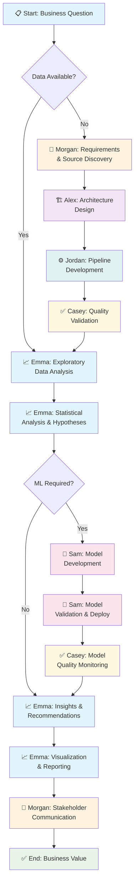
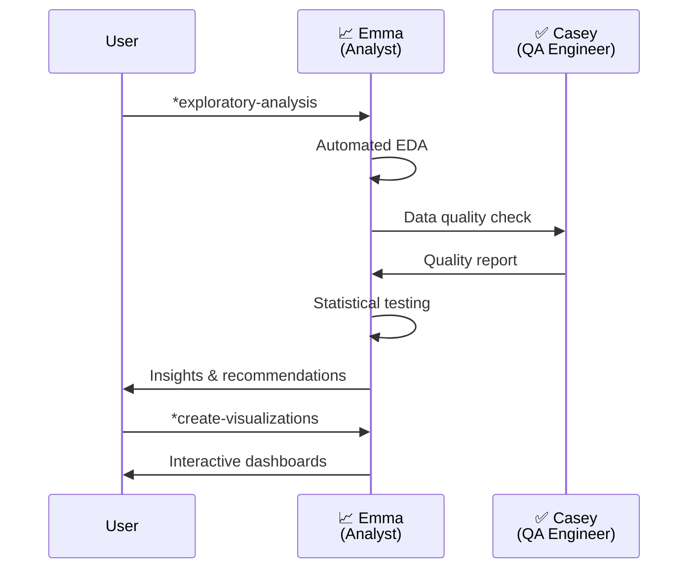

# BMad Data Practitioner Agent System 📊

> **Modern Data Stack Integration for BMad Method**
> 
> Transform your data analysis workflows with 6 specialized AI agents designed for comprehensive data lifecycle management. Powered by PyAirbyte, DuckDB, dbt-core, Dagster, and Evidence.dev.

[](./config.yaml)
[](https://github.com/bmad-method)
[](#tech-stack)

---

## 🚀 Quick Start

### Installation

Choose your preferred installation method:

#### **Option 1: Local Development**
```bash
# Clone or copy the expansion pack
git clone <your-repo-url> bmad-data-practitioner
cd bmad-method
npm install ./path-to/bmad-data-practitioner
```

#### **Option 2: NPM Registry**
```bash
npm install bmad-data-practitioner
```

#### **Option 3: Direct Git Install**
```bash
npm install git+https://github.com/your-org/bmad-data-practitioner
```

### Verification
```bash
# Start BMad Orchestrator
/BMad:agents:bmad-orchestrator

# Check available agents
*agent
```

### First Steps
1. **Start with Analysis**: `*agent data-analyst` for exploratory work
2. **Design Architecture**: `*agent data-architect` for system planning  
3. **Build Pipelines**: `*agent data-engineer` for implementation
4. **Ensure Quality**: `*agent data-qa-engineer` for validation

---

## 🚧 Project Status

### Production Ready ✅
- All 6 specialized AI agents with comprehensive capabilities
- Evidence.dev BI platform with sample dashboards and components
- Dagster orchestration framework with assets, schedules, and sensors
- Python analysis modules (EDA automation, statistical testing, pattern detection, hypothesis generation)
- DuckDB integration with optimized configurations
- PyAirbyte integration for data ingestion
- Comprehensive documentation and user guides

### In Development ⚠️
- dbt transformation asset integration in Dagster (marked as placeholder)
- Evidence.dev publication integration in Dagster (marked as placeholder)
- Additional workflow task templates beyond current 2 tasks
- Expanded SQLMesh implementation (currently minimal)

### Configuration Required 📝
- **dbt-core** must be added to `requirements.txt` before using dbt transformation features
- See [troubleshooting section](#-support--troubleshooting) for setup instructions

---

## 🎭 Specialized Agents

Our 6 AI specialists cover the complete data lifecycle:

### 📈 **Emma - Data Analyst**
**When to use:** Exploratory analysis, statistical testing, insight generation
```bash
*agent data-analyst
```
**Key capabilities:**
- Automated exploratory data analysis (EDA)
- Statistical hypothesis testing and validation
- Business insight generation and recommendations
- Interactive data visualization and storytelling
- Statistical modeling (predictive & descriptive)

### 🏗️ **Marcus - Data Architect**
**When to use:** System design, data modeling, infrastructure planning
```bash
*agent data-architect
```
**Key capabilities:**
- Data warehouse and lake architecture design
- Data modeling and schema optimization
- Technology stack selection and integration
- Scalability and performance planning
- Governance and compliance frameworks

### ⚙️ **Alex - Data Engineer**
**When to use:** ETL/ELT pipelines, data integration, processing workflows
```bash
*agent data-engineer
```
**Key capabilities:**
- Data pipeline development (Dagster orchestration)
- Source system integration (PyAirbyte connectors)
- Data transformation workflows (dbt-core)
- Performance optimization and monitoring
- Data quality implementation

### 🎯 **Sophia - Data Product Manager**
**When to use:** Requirements gathering, stakeholder alignment, strategy
```bash
*agent data-product-manager
```
**Key capabilities:**
- Business requirements elicitation and documentation
- Data product strategy and roadmap development
- Stakeholder communication and alignment
- Success metrics definition and tracking
- Cross-functional team coordination

### ✅ **Riley - Data QA Engineer**
**When to use:** Data quality, testing, validation, monitoring
```bash
*agent data-qa-engineer
```
**Key capabilities:**
- Automated data quality testing frameworks
- Data validation and profiling workflows
- Monitoring and alerting system design
- Data lineage tracking and documentation
- Quality gate implementation

### 🤖 **Jordan - ML Engineer**
**When to use:** Machine learning, model development, ML operations
```bash
*agent ml-engineer
```
**Key capabilities:**
- ML model development and training pipelines
- Feature engineering and selection
- Model deployment and monitoring
- A/B testing and experiment design
- MLOps workflow implementation

---

## 🔄 Suggested Workflow

### **Complete Data Analysis Lifecycle**



### **Quick Analysis Workflow** (Existing Data)



---

## 🛠 Tech Stack Integration

This expansion pack seamlessly integrates with modern data stack tools:

| Tool | Purpose | Agent Integration | Status |
|------|---------|-------------------|--------|
| **PyAirbyte** | Data ingestion | Alex (Data Engineer) | ✅ Ready |
| **DuckDB** | Fast analytics | Emma (Data Analyst) | ✅ Ready |
| **dbt-core** | Data transformation | Alex (Data Engineer) | ⚠️ Add to requirements |
| **SQLMesh** | Alternative transformation | Alex (Data Engineer) | ⚠️ Minimal |
| **Dagster** | Workflow orchestration | Alex (Data Engineer) | ✅ Ready |
| **Evidence.dev** | BI & visualization | Emma (Data Analyst) | ✅ Ready |

**Additional Tools:**
- **ydata-profiling, Sweetviz, AutoViz** - Automated EDA (Emma - Data Analyst)
- **scikit-learn, scipy, statsmodels** - Statistical analysis and ML (Emma, Jordan)

---

## 📁 Project Structure

```
bmad-data-practitioner/
├── agents/                 # 6 specialized AI agents
│   ├── data-analyst.md
│   ├── data-architect.md  
│   ├── data-engineer.md
│   ├── data-product-manager.md
│   ├── data-qa-engineer.md
│   └── ml-engineer.md
├── tasks/                  # Executable workflow tasks
├── templates/              # Document and config templates
├── checklists/            # Quality assurance checklists
├── data/                  # Knowledge base and guides
├── tools/                 # Utility scripts and configs
├── evidence-project/      # Evidence.dev BI setup
├── dagster-project/       # Dagster orchestration
└── config.yaml           # Pack configuration
```

---

## 🎯 Use Cases

### **Business Intelligence**
1. `*agent data-analyst` → Explore sales data patterns
2. Create executive dashboards with Evidence.dev
3. Generate automated insights and recommendations

### **Data Pipeline Development**  
1. `*agent data-architect` → Design system architecture
2. `*agent data-engineer` → Implement with Dagster + dbt
3. `*agent data-qa-engineer` → Validate data quality

### **Machine Learning Projects**
1. `*agent data-product-manager` → Define ML requirements  
2. `*agent data-analyst` → Feature exploration and selection
3. `*agent ml-engineer` → Model development and deployment

### **Data Quality Initiative**
1. `*agent data-qa-engineer` → Assessment and strategy
2. `*agent data-engineer` → Implementation and monitoring
3. `*agent data-analyst` → Impact measurement and reporting

---

## 🚦 Getting Started Guide

### **For Data Analysts**
```bash
*agent data-analyst
*exploratory-analysis    # Start with EDA
*hypothesis-testing      # Statistical validation  
*create-visualizations   # Build dashboards
```

### **For Data Engineers**
```bash
*agent data-engineer
*pipeline-design         # Architecture planning
*source-integration      # PyAirbyte setup
*transformation-logic    # dbt implementation
```

### **For Product Managers**
```bash
*agent data-product-manager  
*requirements-gathering  # Stakeholder interviews
*success-metrics        # KPI definition
*roadmap-planning       # Strategic planning
```

---

## 🤝 Agent Collaboration

Agents work together seamlessly:

- **Sophia** (Product Manager) → defines requirements → **Marcus** (Architect)
- **Marcus** (Architect) → creates design → **Alex** (Engineer)
- **Alex** (Engineer) → builds pipeline → **Riley** (QA Engineer)
- **Riley** (QA Engineer) → validates data → **Emma** (Analyst)
- **Emma** (Analyst) → finds insights → **Jordan** (ML Engineer)
- **Jordan** (ML Engineer) → deploys models → **Sophia** (Product Manager)

---

## 📚 Documentation

- **Agent Commands**: Each agent has built-in `*help` command
- **Task Templates**: Comprehensive workflow guides in `/tasks`
- **Best Practices**: Data methodology guides in `/data`  
- **Configuration**: Tool setup guides in `/tools`

---

## 🔧 Advanced Configuration

### Custom Templates
Add your own templates to the `/templates` directory following BMad format.

### Extended Workflows  
Create custom workflows in `/workflows` for domain-specific processes.

### Integration Setup
- **Evidence.dev**: Pre-configured project in `/evidence-project`
- **Dagster**: Orchestration setup in `/dagster-project`  
- **DuckDB**: Optimized for analytical queries

---

## 🤖 BMad Orchestrator Integration

All agents integrate with BMad Orchestrator:

```bash
/BMad:agents:bmad-orchestrator

*help                    # Show all commands
*agent                   # List available agents
*workflow-guidance       # Get workflow recommendations  
*plan                    # Create detailed execution plan
*status                  # Check current progress
```

---

## 💡 Tips & Best Practices

1. **Start Small**: Begin with `*agent data-analyst` for quick wins
2. **Plan First**: Use `*agent data-product-manager` for complex projects  
3. **Quality Gates**: Always involve `*agent data-qa-engineer`
4. **Collaborate**: Agents work better together than in isolation
5. **Document**: Use built-in templates for consistent documentation

---

## 🆘 Support & Troubleshooting

### Common Issues

#### Agent Names Don't Match Documentation
**Issue:** Agents introduce themselves with different names than expected
**Resolution:** This is expected behavior. The agents use these actual names:
- **Marcus** (Data Architect) - not "Alex"
- **Alex** (Data Engineer) - not "Jordan"
- **Sophia** (Data Product Manager) - not "Morgan"
- **Riley** (Data QA Engineer) - not "Casey"
- **Emma** (Data Analyst) - correct ✅
- **Jordan** (ML Engineer) - not "Sam"

#### dbt Commands Fail
**Issue:** `dbt run` or other dbt commands result in "command not found" or import errors
**Resolution:** Add dbt-core to your Python environment:
```bash
# Add to requirements.txt
echo "dbt-core>=1.7.0" >> requirements.txt
echo "dbt-duckdb>=1.7.0" >> requirements.txt

# Install dependencies
pip install -r requirements.txt

# Verify installation
dbt --version
```

#### Dagster Transformation Assets Show as Placeholder
**Issue:** Transformation and publication assets in Dagster are marked as "placeholder" or "future integration"
**Resolution:** This is expected - the dbt and Evidence.dev integrations within Dagster are marked for future development. Current workarounds:
- Use dbt CLI directly for transformations: `dbt run --project-dir ./bmad-data-practitioner/dbt-project`
- Use the `*agent data-engineer` for guided transformation workflows
- Evidence.dev runs independently - see `/bmad-method/expansion-packs/bmad-data-practitioner/evidence-project/`

#### PyAirbyte Connection Issues
**Issue:** Cannot connect to data sources via PyAirbyte
**Resolution:**
1. Verify PyAirbyte installation: `pip show airbyte`
2. Check connector availability: `python -c "import airbyte; print(airbyte.__version__)"`
3. Review PyAirbyte documentation for source-specific configuration
4. Use `*agent data-engineer` for guided setup

#### Limited Task Templates
**Issue:** Expected more workflow task templates
**Resolution:** Currently, only 2 task templates are implemented:
- `hypothesis-testing.md` - Statistical hypothesis testing workflow
- `data-source-discovery.md` - Data source discovery workflow

For additional workflows, use agent `*help` commands or create custom tasks following the existing template patterns.

### Getting Help
1. **Agent Help**: Use `*help` command in any agent for agent-specific assistance
2. **Agent Documentation**: Review agent `.md` files in `/bmad-method/expansion-packs/bmad-data-practitioner/agents/`
3. **Project Documentation**: Check comprehensive guides in `/docs/`
4. **BMad Orchestrator**: Ask `/BMad:agents:bmad-orchestrator` for workflow guidance

---

## 📄 License

This expansion pack follows BMad Method licensing terms.

---

## 🚀 Ready to Transform Your Data Workflows?

```bash
# Install the pack
npm install bmad-data-practitioner

# Start your first analysis  
/BMad:agents:bmad-orchestrator
*agent data-analyst
*exploratory-analysis
```

**Welcome to the future of AI-assisted data analysis! 🎉**