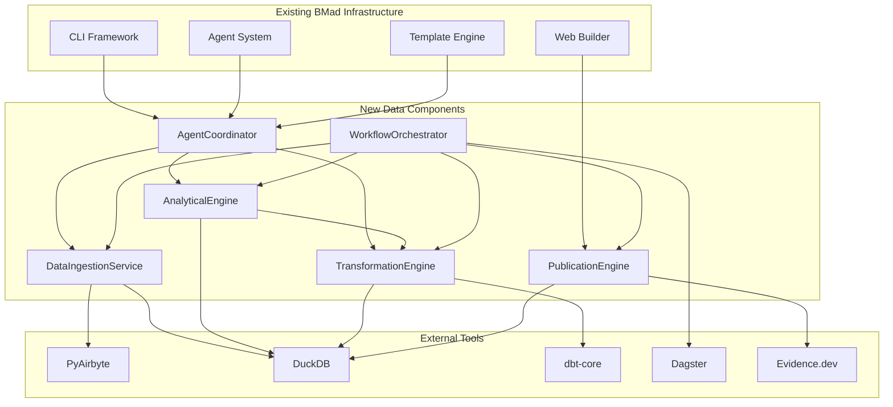

# Component Architecture

## New Components

### DataIngestionService
**Responsibility:** Manages PyAirbyte connector execution, data source discovery, and initial data validation for diverse input sources  
**Integration Points:** Extends existing CLI tool patterns under tools/ directory, integrates with core-config.yaml for connection management

**Key Interfaces:**
- REST API endpoints for file upload and database connection configuration
- PyAirbyte subprocess execution with JSON communication protocols
- DuckDB connection interface for data loading and validation
- YAML configuration interface following existing technical-preferences patterns

**Dependencies:**
- **Existing Components:** CLI framework (commander), file system utilities (fs-extra), configuration management (js-yaml)
- **New Components:** AnalyticalEngine, WorkflowOrchestrator
- **Technology Stack:** Node.js with Python subprocess execution, PyAirbyte ^0.20.0, connection pooling

### AnalyticalEngine  
**Responsibility:** Manages DuckDB embedded database operations, automated EDA execution, and LLM-agnostic hypothesis generation workflows  
**Integration Points:** Core analytical processing component with direct integration to existing agent workflow patterns

**Key Interfaces:**
- DuckDB query execution interface with memory management and partitioning
- Automated EDA tool integration (pandas-profiling, Sweetviz, AutoViz)
- LLM hypothesis generation interface supporting multiple providers (OpenAI, Anthropic, Google, local models)
- Statistical testing framework integration with configurable test selection

**Dependencies:**
- **Existing Components:** Agent orchestration system, template engine, natural language workflow processing
- **New Components:** DataIngestionService (data sources), TransformationEngine (processed data)
- **Technology Stack:** DuckDB ^1.1.3, Python subprocess execution, configurable LLM interfaces

### TransformationEngine
**Responsibility:** Executes dbt-core transformation workflows, manages data lineage tracking, and maintains data quality through comprehensive testing  
**Integration Points:** Follows existing task execution patterns, integrates with BMad template system for guided ELT workflows

**Key Interfaces:**
- dbt-core project initialization and model execution
- Guided ELT modeling templates following BMad elicitation patterns
- Data quality testing framework with automated test generation
- Lineage visualization and documentation generation

**Dependencies:**
- **Existing Components:** Task execution framework, template engine, validation systems
- **New Components:** AnalyticalEngine (data sources), WorkflowOrchestrator (pipeline coordination)
- **Technology Stack:** dbt-core ^1.8.8, Python subprocess execution, YAML-based configuration

### WorkflowOrchestrator  
**Responsibility:** Manages Dagster asset-centric workflow orchestration, pipeline scheduling, and comprehensive monitoring across all data operations  
**Integration Points:** Extends existing BMad workflow patterns with sophisticated dependency management and execution tracking

**Key Interfaces:**
- Dagster asset definition and dependency management
- Pipeline scheduling and trigger mechanism configuration
- Monitoring dashboard integration with existing BMad progress tracking
- Error handling and retry logic following BMad failure recovery patterns

**Dependencies:**
- **Existing Components:** CLI orchestration, progress tracking (ora), workflow management systems
- **New Components:** DataIngestionService, AnalyticalEngine, TransformationEngine, PublicationEngine
- **Technology Stack:** Dagster ^1.8.12, Python subprocess execution, web UI integration

### PublicationEngine
**Responsibility:** Generates publication-quality insight documents through Evidence.dev integration, automated narrative generation, and multi-format export capabilities  
**Integration Points:** Extends existing web-builder patterns, integrates with BMad documentation generation workflows

**Key Interfaces:**
- Evidence.dev static site generation with Universal SQL integration
- Automated narrative generation using LLM capabilities following Pew Research patterns
- Interactive visualization configuration and responsive design management
- Multi-format export (PDF, HTML, static) with deployment integration

**Dependencies:**
- **Existing Components:** Web-builder system, documentation patterns, deployment workflows
- **New Components:** AnalyticalEngine (data sources), TransformationEngine (processed data)
- **Technology Stack:** Evidence.dev ^25.0.0, Universal SQL with DuckDB WASM, static site generation

### AgentCoordinator
**Responsibility:** Manages the 6 specialized data agents (data-product-manager, data-architect, data-engineer, data-analyst, ml-engineer, data-qa-engineer) following BMad agent orchestration patterns  
**Integration Points:** Extends existing agent management system, maintains full compatibility with BMad agent definition schemas

**Key Interfaces:**
- YAML-based agent definition processing following existing patterns
- Cross-agent workflow coordination and handoff management
- Specialized data agent command execution and validation
- Integration with existing IDE configurations (Cursor, Claude Code, Windsurf, VS Code)

**Dependencies:**
- **Existing Components:** Agent orchestration system, YAML processing, IDE integration patterns
- **New Components:** All data processing components for specialized agent workflows
- **Technology Stack:** Node.js agent framework, YAML configuration, natural language processing

## Component Interaction Diagram

