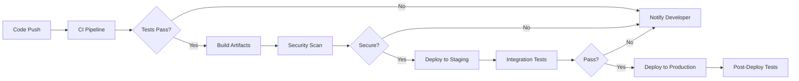

# CI/CD Pipeline Documentation

## Overview

This document provides comprehensive documentation for the Data Practitioner Agent System CI/CD pipeline, including setup instructions, workflow definitions, and best practices for continuous integration and deployment.

## Pipeline Architecture



## GitHub Actions Workflows

### Main CI/CD Workflow

Create `.github/workflows/main.yml`:

```yaml
name: CI/CD Pipeline

on:
  push:
    branches: [main, develop]
  pull_request:
    branches: [main]

env:
  NODE_VERSION: '18.x'
  PYTHON_VERSION: '3.10'

jobs:
  lint-and-test:
    runs-on: ubuntu-latest
    
    steps:
    - uses: actions/checkout@v3
    
    - name: Setup Node.js
      uses: actions/setup-node@v3
      with:
        node-version: ${{ env.NODE_VERSION }}
        cache: 'npm'
    
    - name: Setup Python
      uses: actions/setup-python@v4
      with:
        python-version: ${{ env.PYTHON_VERSION }}
    
    - name: Cache dependencies
      uses: actions/cache@v3
      with:
        path: |
          ~/.npm
          ~/.cache/pip
          .venv
        key: ${{ runner.os }}-deps-${{ hashFiles('**/package-lock.json', '**/requirements.txt') }}
    
    - name: Install Node dependencies
      run: npm ci
    
    - name: Install Python dependencies
      run: |
        python -m venv .venv
        source .venv/bin/activate
        pip install -r requirements.txt
    
    - name: Run linters
      run: |
        npm run lint
        source .venv/bin/activate
        flake8 .
        black --check .
    
    - name: Run tests
      run: |
        npm test -- --coverage
        source .venv/bin/activate
        pytest --cov=. --cov-report=xml
    
    - name: Upload coverage
      uses: codecov/codecov-action@v3
      with:
        files: ./coverage/lcov.info,./coverage.xml

  security-scan:
    needs: lint-and-test
    runs-on: ubuntu-latest
    
    steps:
    - uses: actions/checkout@v3
    
    - name: Run security audit
      run: |
        npm audit --production
        pip-audit
    
    - name: SAST scan
      uses: github/super-linter@v4
      env:
        DEFAULT_BRANCH: main
        GITHUB_TOKEN: ${{ secrets.GITHUB_TOKEN }}
        VALIDATE_JAVASCRIPT_ES: true
        VALIDATE_PYTHON_BLACK: true
        VALIDATE_PYTHON_FLAKE8: true
    
    - name: Dependency check
      uses: dependency-check/Dependency-Check_Action@main
      with:
        project: 'data-practitioner-agent-system'
        path: '.'
        format: 'HTML'

  build:
    needs: security-scan
    runs-on: ubuntu-latest
    
    steps:
    - uses: actions/checkout@v3
    
    - name: Build Docker image
      run: |
        docker build -t data-practitioner:${{ github.sha }} .
        docker tag data-practitioner:${{ github.sha }} data-practitioner:latest
    
    - name: Push to registry
      if: github.ref == 'refs/heads/main'
      run: |
        echo ${{ secrets.DOCKER_PASSWORD }} | docker login -u ${{ secrets.DOCKER_USERNAME }} --password-stdin
        docker push data-practitioner:${{ github.sha }}
        docker push data-practitioner:latest

  deploy-staging:
    needs: build
    if: github.ref == 'refs/heads/main'
    runs-on: ubuntu-latest
    environment: staging
    
    steps:
    - name: Deploy to staging
      run: |
        # Deployment script here
        echo "Deploying to staging..."
    
    - name: Run smoke tests
      run: |
        npm run test:e2e:staging

  deploy-production:
    needs: deploy-staging
    if: github.ref == 'refs/heads/main'
    runs-on: ubuntu-latest
    environment: production
    
    steps:
    - name: Deploy to production
      run: |
        # Production deployment with feature flags
        echo "Deploying to production with feature flags..."
    
    - name: Post-deployment verification
      run: |
        npm run test:e2e:production
        npm run test:performance
```

### Story-Specific Workflows

Create `.github/workflows/story-validation.yml`:

```yaml
name: Story Validation

on:
  pull_request:
    paths:
      - 'stories/**'
      - 'tools/data-services/**'

jobs:
  validate-story:
    runs-on: ubuntu-latest
    
    steps:
    - uses: actions/checkout@v3
    
    - name: Identify changed story
      id: story
      run: |
        # Script to identify which story changed
        echo "::set-output name=story_id::$(./scripts/identify-story.sh)"
    
    - name: Run story-specific tests
      run: |
        npm run test:story -- --story=${{ steps.story.outputs.story_id }}
    
    - name: Validate feature flags
      run: |
        npm run validate:feature-flags -- --story=${{ steps.story.outputs.story_id }}
    
    - name: Check rollback procedures
      run: |
        ./scripts/test-rollback.sh ${{ steps.story.outputs.story_id }}
```

## Local Development Pipeline

### Pre-commit Hooks

Create `.husky/pre-commit`:

```bash
#!/bin/sh
. "$(dirname "$0")/_/husky.sh"

# Run linters
npm run lint:staged

# Run unit tests for changed files
npm run test:changed

# Check for secrets
npm run security:secrets

# Validate Python code
if git diff --cached --name-only | grep -q '\.py$'; then
  source .venv/bin/activate
  black --check $(git diff --cached --name-only | grep '\.py$')
  flake8 $(git diff --cached --name-only | grep '\.py$')
fi
```

### Pre-push Hooks

Create `.husky/pre-push`:

```bash
#!/bin/sh
. "$(dirname "$0")/_/husky.sh"

# Run full test suite
npm test

# Check for dependency vulnerabilities
npm audit

# Validate feature flags
npm run validate:feature-flags

# Run integration tests
npm run test:integration
```

## Docker Configuration

### Multi-stage Dockerfile

```dockerfile
# Build stage
FROM node:18-alpine AS node-builder
WORKDIR /app
COPY package*.json ./
RUN npm ci --only=production

FROM python:3.10-slim AS python-builder
WORKDIR /app
COPY requirements.txt ./
RUN pip install --user -r requirements.txt

# Runtime stage
FROM node:18-python3.10-slim
WORKDIR /app

# Copy Node.js dependencies
COPY --from=node-builder /app/node_modules ./node_modules

# Copy Python dependencies
COPY --from=python-builder /root/.local /root/.local

# Copy application code
COPY . .

# Security: Run as non-root user
RUN useradd -m -u 1001 appuser && chown -R appuser:appuser /app
USER appuser

# Health check
HEALTHCHECK --interval=30s --timeout=3s --start-period=40s --retries=3 \
  CMD node healthcheck.js

EXPOSE 3000
CMD ["npm", "start"]
```

## Environment-Specific Configurations

### Development

```yaml
# config/environments/development.yml
environment: development
debug: true
log_level: debug
feature_flags:
  all_enabled: true
database:
  host: localhost
  pool_size: 5
cache:
  enabled: false
```

### Staging

```yaml
# config/environments/staging.yml
environment: staging
debug: false
log_level: info
feature_flags:
  gradual_rollout: true
database:
  host: staging-db.internal
  pool_size: 20
cache:
  enabled: true
  ttl: 3600
monitoring:
  enabled: true
  sample_rate: 0.1
```

### Production

```yaml
# config/environments/production.yml
environment: production
debug: false
log_level: warning
feature_flags:
  safe_mode: true
database:
  host: prod-db.internal
  pool_size: 50
  read_replicas:
    - prod-db-read-1.internal
    - prod-db-read-2.internal
cache:
  enabled: true
  ttl: 86400
monitoring:
  enabled: true
  sample_rate: 0.01
```

## Deployment Strategies

### Blue-Green Deployment

```bash
#!/bin/bash
# scripts/deploy-blue-green.sh

CURRENT_COLOR=$(kubectl get service/app -o jsonpath='{.spec.selector.color}')
NEW_COLOR=$([[ "$CURRENT_COLOR" == "blue" ]] && echo "green" || echo "blue")

echo "Deploying to $NEW_COLOR environment..."

# Deploy new version
kubectl set image deployment/app-$NEW_COLOR app=data-practitioner:$VERSION

# Wait for rollout
kubectl rollout status deployment/app-$NEW_COLOR

# Run health checks
./scripts/health-check.sh $NEW_COLOR

# Switch traffic
kubectl patch service/app -p '{"spec":{"selector":{"color":"'$NEW_COLOR'"}}}'

echo "Deployment complete. Traffic now routing to $NEW_COLOR"
```

### Canary Deployment

```yaml
# k8s/canary-deployment.yaml
apiVersion: v1
kind: Service
metadata:
  name: app-canary
spec:
  selector:
    app: data-practitioner
    version: canary
---
apiVersion: apps/v1
kind: Deployment
metadata:
  name: app-canary
spec:
  replicas: 1  # Start with 10% of traffic
  selector:
    matchLabels:
      app: data-practitioner
      version: canary
  template:
    metadata:
      labels:
        app: data-practitioner
        version: canary
    spec:
      containers:
      - name: app
        image: data-practitioner:canary
```

## Monitoring and Alerts

### Pipeline Metrics

```yaml
# .github/workflows/metrics.yml
name: Pipeline Metrics

on:
  workflow_run:
    workflows: ["CI/CD Pipeline"]
    types: [completed]

jobs:
  collect-metrics:
    runs-on: ubuntu-latest
    
    steps:
    - name: Calculate metrics
      run: |
        # Build time
        BUILD_TIME=${{ github.event.workflow_run.run_duration_ms }}
        
        # Test coverage
        COVERAGE=$(curl -s https://codecov.io/api/gh/${{ github.repository }}/branch/main | jq '.commit.totals.c')
        
        # Success rate
        SUCCESS_RATE=$(curl -s -H "Authorization: token ${{ secrets.GITHUB_TOKEN }}" \
          "https://api.github.com/repos/${{ github.repository }}/actions/runs?branch=main&status=completed" | \
          jq '.workflow_runs | map(select(.conclusion == "success")) | length / 100')
    
    - name: Send to monitoring
      run: |
        curl -X POST https://monitoring.internal/metrics \
          -H "Content-Type: application/json" \
          -d '{
            "pipeline_build_time": '$BUILD_TIME',
            "test_coverage": '$COVERAGE',
            "success_rate": '$SUCCESS_RATE'
          }'
```

### Alert Configuration

```yaml
# monitoring/alerts.yml
alerts:
  - name: PipelineFailure
    condition: pipeline_success_rate < 0.8
    severity: warning
    notification:
      - slack: "#ci-cd-alerts"
      - email: "devops@company.com"
  
  - name: LongBuildTime
    condition: pipeline_build_time > 1800000  # 30 minutes
    severity: warning
    notification:
      - slack: "#ci-cd-alerts"
  
  - name: SecurityVulnerability
    condition: security_scan_critical > 0
    severity: critical
    notification:
      - pagerduty: "security-team"
      - slack: "#security-alerts"
```

## Best Practices

### 1. Pipeline as Code
- All pipeline configurations in version control
- Review pipeline changes like code changes
- Test pipeline changes in feature branches

### 2. Fast Feedback
- Fail fast on critical issues
- Run quick tests first
- Parallelize where possible

### 3. Security Integration
- Security scans on every build
- Dependency vulnerability checks
- Secret scanning
- SAST/DAST integration

### 4. Artifact Management
- Immutable artifacts
- Version everything
- Clean up old artifacts
- Sign critical artifacts

### 5. Environment Parity
- Keep environments as similar as possible
- Use same deployment process
- Configuration as code
- Infrastructure as code

### 6. Rollback Readiness
- Always have rollback plan
- Test rollback procedures
- Automate rollback triggers
- Monitor post-rollback

### 7. Documentation
- Document all procedures
- Keep runbooks updated
- Record decisions
- Share knowledge

## Troubleshooting

### Common Issues

1. **Build Failures**
   - Check dependency versions
   - Clear caches
   - Review recent changes
   - Check for flaky tests

2. **Deployment Failures**
   - Verify credentials
   - Check resource limits
   - Review configuration
   - Check network connectivity

3. **Test Failures**
   - Run locally first
   - Check for environment differences
   - Review test dependencies
   - Look for timing issues

### Debug Commands

```bash
# View pipeline logs
gh run view [run-id] --log

# Re-run failed jobs
gh run rerun [run-id] --failed

# Download artifacts
gh run download [run-id]

# View secret values (masked)
gh secret list

# Test workflow locally
act -j build
```

## Maintenance

### Weekly Tasks
- Review pipeline metrics
- Update dependencies
- Clean up old artifacts
- Review security alerts

### Monthly Tasks
- Update pipeline dependencies
- Review and optimize build times
- Update documentation
- Conduct pipeline review

### Quarterly Tasks
- Major version updates
- Security audit
- Performance optimization
- Disaster recovery test

---
*Created: 2025-08-09*
*Version: 1.0*
*Owner: DevOps Team*