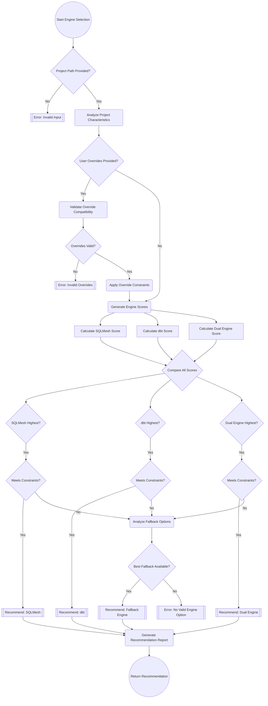
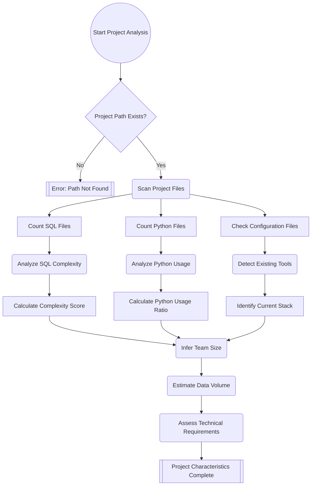
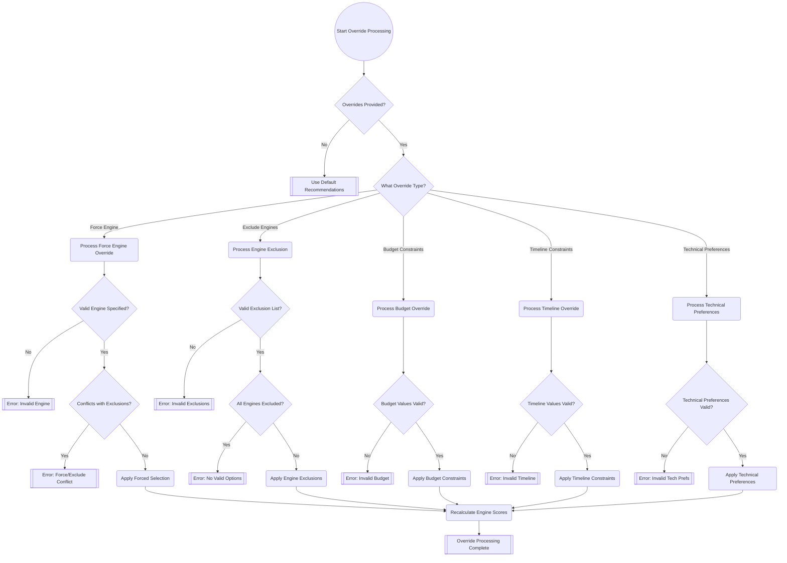
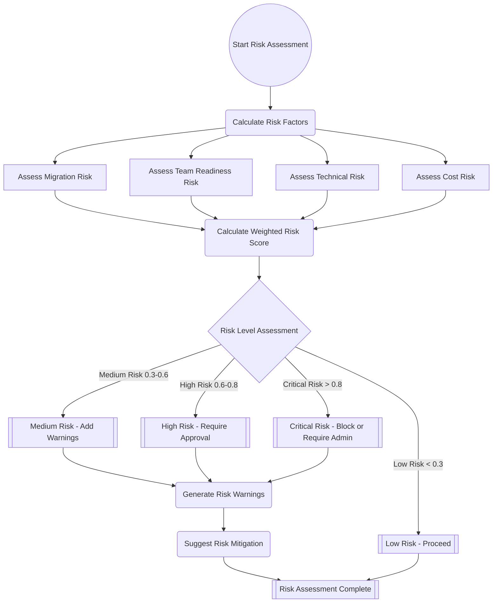
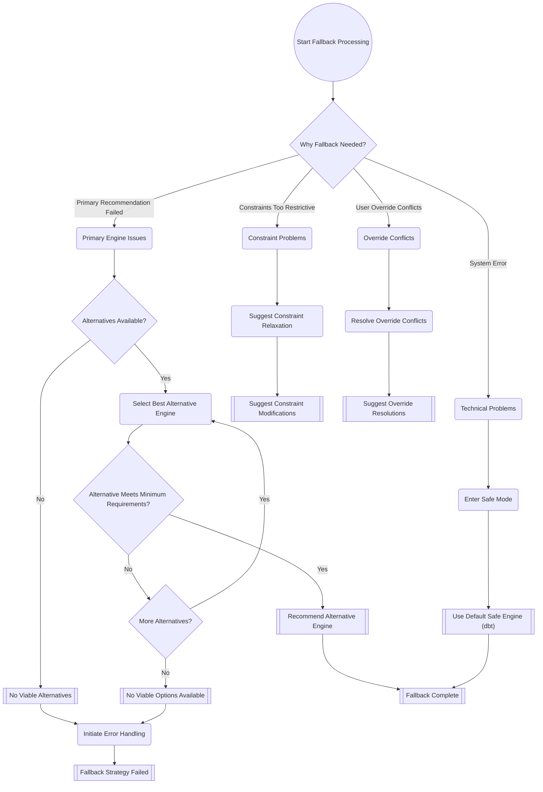
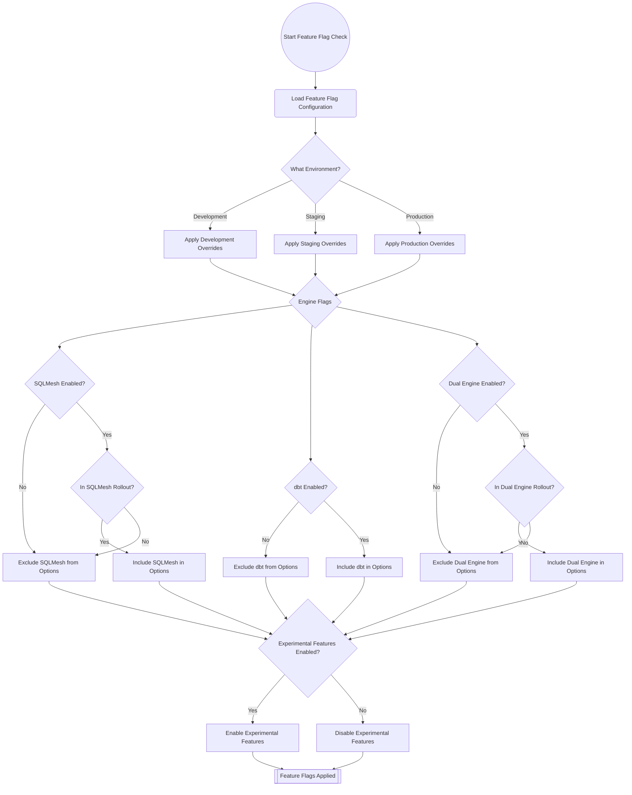
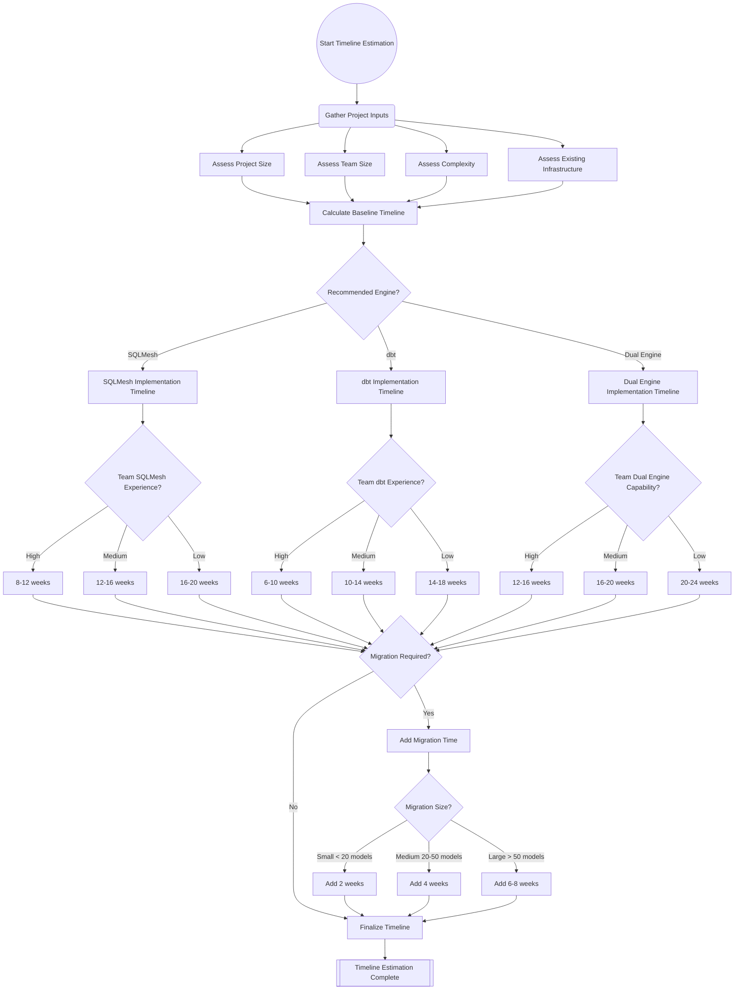
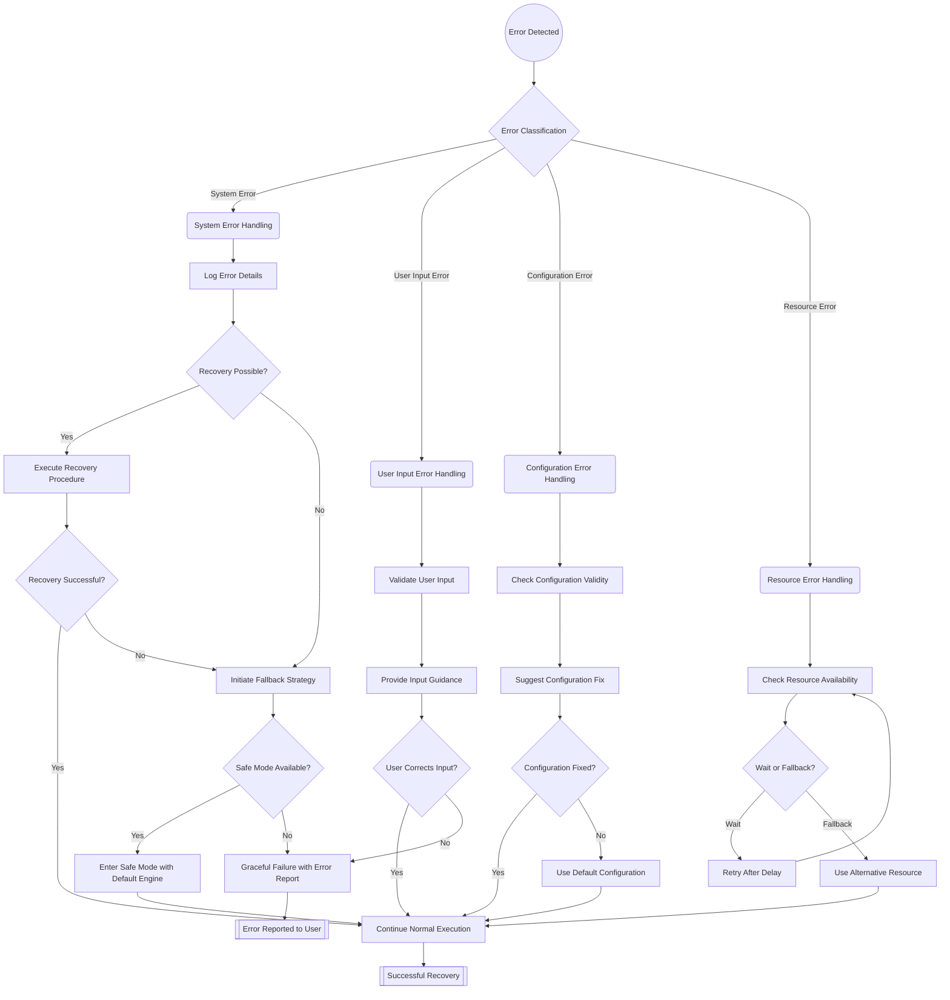
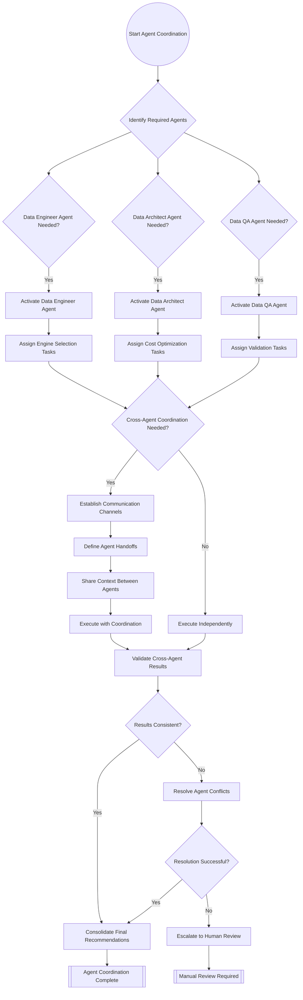

# Agent Selection Decision Flowchart

## Overview

This document provides visual decision trees and flowcharts for transformation engine selection logic, user override processing, and agent recommendation workflows. These flowcharts serve as both documentation and implementation guides for the intelligent agent system.

## Visual Decision Flow Legend

```
[Decision Node]     - Diamond shape, contains yes/no questions
(Process Node)      - Rectangle shape, contains actions or processes
{Input/Output}      - Parallelogram shape, contains data inputs/outputs
((Start/End))       - Circle shape, contains flow start/end points
```

## Primary Engine Selection Decision Tree



## Project Characteristic Analysis Flow



## User Override Processing Decision Tree



## Risk Assessment Decision Flow



## Fallback Strategy Decision Tree



## Feature Flag Integration Flow



## Implementation Timeline Decision Flow



## Error Handling and Recovery Flow



## Agent Coordination Decision Flow



## Decision Tree Implementation Guide

### Code Integration Points

Each decision flow maps to specific implementation points in the codebase:

1. **Primary Engine Selection** → `agents/shared/auto-detection/engine-detection-algorithm.py::detect_and_recommend_engine()`
2. **Project Analysis** → `agents/shared/auto-detection/engine-detection-algorithm.py::ProjectAnalyzer`
3. **User Override Processing** → `docs/patterns/user-override-patterns.md` implementation
4. **Risk Assessment** → `agents/shared/auto-detection/engine-detection-algorithm.py::EngineRecommendationEngine._calculate_risk_score()`
5. **Fallback Strategy** → `agents/shared/error-handling/fallback-strategies.py`
6. **Feature Flags** → `config/feature-flags/transformation-engine-flags.yaml`

### Testing Decision Trees

Each decision path should be tested with representative scenarios:

```python
# Example test cases for decision tree validation
def test_engine_selection_decision_tree():
    """Test primary engine selection flow."""
    
    # Test Path: SQLMesh wins with valid constraints
    characteristics = create_sqlmesh_favorable_characteristics()
    recommendation = detect_and_recommend_engine("./test_project", characteristics)
    assert recommendation.recommended_engine == "sqlmesh"
    
    # Test Path: Fallback due to constraints
    restrictive_constraints = {"exclude_engines": ["sqlmesh", "dual_engine"]}
    recommendation = detect_and_recommend_engine("./test_project", restrictive_constraints)
    assert recommendation.recommended_engine == "dbt"  # Fallback
    
    # Test Path: No valid options error
    impossible_constraints = {"exclude_engines": ["sqlmesh", "dbt", "dual_engine"]}
    with pytest.raises(ValueError, match="No valid engine option"):
        detect_and_recommend_engine("./test_project", impossible_constraints)

def test_override_processing_decision_tree():
    """Test user override processing flow."""
    
    # Test Path: Valid force override
    overrides = {"force_engine": "sqlmesh"}
    result = process_user_overrides(overrides)
    assert result.is_valid
    assert result.applied_overrides["forced_engine"] == "sqlmesh"
    
    # Test Path: Conflict error
    conflicting_overrides = {
        "force_engine": "sqlmesh",
        "exclude_engines": ["sqlmesh"]
    }
    result = process_user_overrides(conflicting_overrides)
    assert not result.is_valid
    assert "conflict" in result.error_message.lower()

def test_risk_assessment_decision_tree():
    """Test risk assessment flow."""
    
    # Test Path: Low risk scenario
    low_risk_characteristics = create_low_risk_characteristics()
    risk_assessment = assess_recommendation_risk(low_risk_characteristics)
    assert risk_assessment.risk_level == "low"
    assert risk_assessment.risk_score < 0.3
    
    # Test Path: High risk scenario requiring approval
    high_risk_characteristics = create_high_risk_characteristics()
    risk_assessment = assess_recommendation_risk(high_risk_characteristics)
    assert risk_assessment.risk_level == "high"
    assert risk_assessment.requires_approval
```

### Decision Tree Maintenance

These decision trees should be updated when:

1. **New engines are added** → Update primary selection flow
2. **New override types are supported** → Update override processing flow
3. **Risk factors change** → Update risk assessment flow
4. **Feature flags evolve** → Update feature flag integration flow
5. **Agent coordination patterns change** → Update coordination flow

### Visual Representation Tools

The Mermaid diagrams in this document can be rendered using:

- **GitHub/GitLab** → Native Mermaid rendering
- **VS Code** → Mermaid Preview extension
- **Documentation Sites** → MkDocs with Mermaid plugin
- **Presentation Tools** → Export to SVG/PNG for slides

### Decision Tree Metrics

Track decision tree effectiveness with metrics:

```yaml
decision_tree_metrics:
  path_coverage:
    primary_selection: "Percentage of selection paths exercised"
    override_processing: "Percentage of override paths tested"
    risk_assessment: "Percentage of risk scenarios covered"
    
  decision_accuracy:
    correct_engine_selections: "Percentage of optimal selections"
    override_conflict_detection: "Percentage of conflicts caught"
    risk_score_accuracy: "Correlation with actual outcomes"
    
  performance_metrics:
    decision_latency: "Time to complete decision flows"
    memory_usage: "Resource consumption during processing"
    error_rate: "Percentage of flows resulting in errors"
```

This comprehensive decision flowchart documentation provides clear visual guidance for implementing and maintaining the intelligent transformation engine selection system.