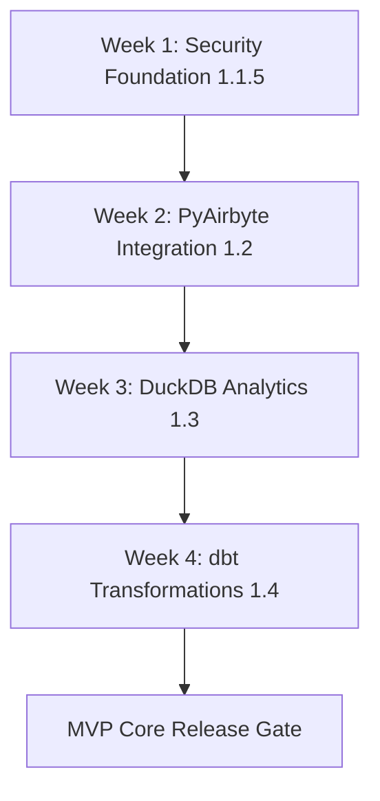
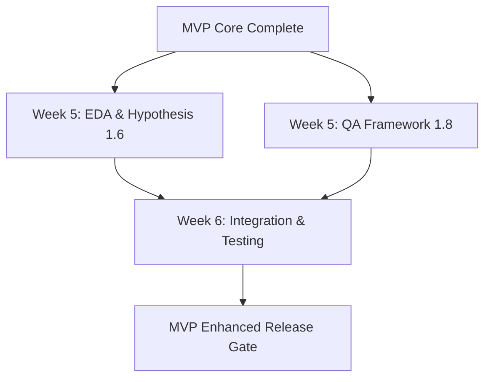
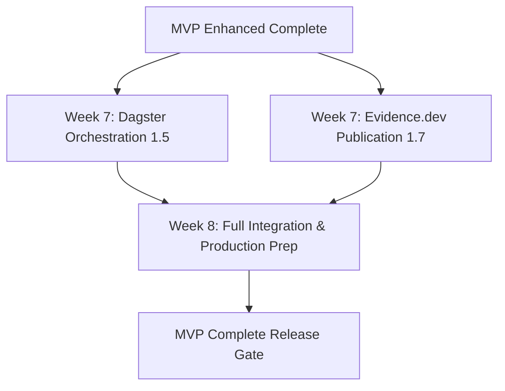
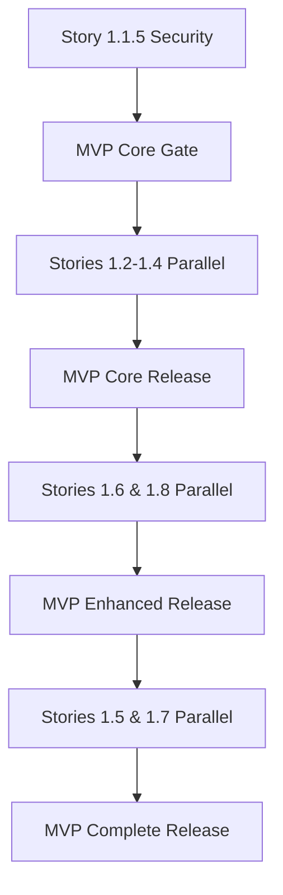

# MVP Tiered Delivery Strategy - Data Practitioner Agent System

## Overview

This document addresses the complexity of delivering 8 stories in a single MVP by restructuring the delivery into 3 progressive tiers. Each tier provides independent value while building toward the complete Data Practitioner Agent System functionality.

## Strategic Rationale

### Problem Statement
The original single MVP approach with 8 stories (1.1.5, 1.2-1.8) presents challenges:
- **High Risk**: Single large release with multiple integration points
- **Delayed Value**: Users wait 8+ weeks for any functionality  
- **Complex Validation**: Difficult to isolate issues across 8 integrated components
- **Resource Coordination**: Requires perfect synchronization across all development streams

### Solution: Progressive Value Delivery
Break the MVP into 3 tiers, each representing a complete, valuable increment:
1. **MVP Core**: Essential data pipeline with security foundation
2. **MVP Enhanced**: Intelligent analysis and quality capabilities  
3. **MVP Complete**: Full orchestration and publication features

## Tier Definitions

### MVP Core (Tier 1) - "Secure Data Foundation"

**Timeline**: Weeks 1-4  
**Value Proposition**: Secure, authenticated data ingestion and basic analytics capability

#### Stories Included
- ✅ **Story 1.1**: Foundation (Already Complete)
- 🔴 **Story 1.1.5**: Security & Risk Management Foundation (CRITICAL PATH)
- 🔴 **Story 1.2**: PyAirbyte Integration
- 🔴 **Story 1.3**: DuckDB Integration  
- 🔴 **Story 1.4**: dbt Integration

#### Core Value Delivery
```
User Journey: Data Engineer
"I can securely ingest data from multiple sources, 
transform it using dbt, and query it with DuckDB, 
all within the BMad-Method framework with proper authentication."

Key Capabilities:
✓ Secure API key authentication system
✓ Feature flag-controlled rollouts  
✓ Multi-source data ingestion via PyAirbyte
✓ In-memory analytical processing via DuckDB
✓ Data transformation workflows via dbt-core
✓ Complete rollback procedures for all components
```

#### Success Metrics
- **Security**: 100% of endpoints protected by authentication
- **Data Pipeline**: Successful ingestion → transformation → analysis flow
- **Performance**: <30s for typical dataset transformation (up to 10MB)
- **Integration**: Zero degradation in existing BMad-Method functionality
- **Rollback**: <5 minutes rollback time for any component

#### Feature Flag Configuration  
```yaml
# MVP Core Feature Flags
security_foundation: true
api_key_authentication: true
pyairbyte_ingestion: true
duckdb_analytics: true
dbt_transformations: true

# Disabled in MVP Core
dagster_orchestration: false
eda_hypothesis_generation: false
evidence_publication: false
automated_qa_framework: false
```

#### Acceptance Criteria for MVP Core Release
- [ ] **Security Gate**: All endpoints require valid API key authentication
- [ ] **Data Flow Gate**: Complete data ingestion → DuckDB → dbt → analytics workflow
- [ ] **Performance Gate**: Pipeline processes 10MB dataset in <30 seconds
- [ ] **Integration Gate**: Existing BMad-Method agents and workflows unaffected
- [ ] **Documentation Gate**: Core user guide and troubleshooting docs complete
- [ ] **Rollback Gate**: All components can be safely rolled back in <5 minutes

---

### MVP Enhanced (Tier 2) - "Intelligent Analysis"

**Timeline**: Weeks 5-6  
**Value Proposition**: AI-powered analysis capabilities with comprehensive quality assurance

#### Stories Included  
- 🔴 **Story 1.6**: EDA & Hypothesis Generation
- 🔴 **Story 1.8**: QA Framework

#### Enhanced Value Delivery
```
User Journey: Data Analyst  
"I can automatically generate hypotheses from my data,
run exploratory data analysis, and ensure data quality
through comprehensive testing frameworks."

Additional Capabilities (building on MVP Core):
✓ Automated exploratory data analysis (EDA)
✓ LLM-powered hypothesis generation (multi-provider support)  
✓ Statistical testing and validation frameworks
✓ Comprehensive data quality validation
✓ Integration testing for the entire data pipeline
✓ Advanced troubleshooting and diagnostic capabilities
```

#### Success Metrics
- **Analysis Speed**: EDA report generation <2 minutes for 10MB dataset
- **Hypothesis Quality**: >80% of generated hypotheses validated as meaningful
- **QA Coverage**: >90% test coverage across all data pipeline components
- **LLM Integration**: Multi-provider failover working (OpenAI → Anthropic → Local)
- **Data Quality**: Automated detection of >95% of common data issues

#### Feature Flag Configuration
```yaml
# MVP Enhanced adds these flags (MVP Core flags remain true)
eda_hypothesis_generation: true
llm_multi_provider_support: true  
automated_qa_framework: true
statistical_testing: true
data_quality_monitoring: true

# Still disabled in MVP Enhanced
dagster_orchestration: false
evidence_publication: false
```

#### Acceptance Criteria for MVP Enhanced Release
- [ ] **Analysis Gate**: Automated EDA reports generated with visualizations
- [ ] **Hypothesis Gate**: LLM providers generate testable hypotheses with failover
- [ ] **Quality Gate**: Automated data quality checks detect anomalies and issues
- [ ] **Testing Gate**: Comprehensive test suite validates end-to-end functionality
- [ ] **Performance Gate**: Analysis workflows complete within performance targets
- [ ] **Documentation Gate**: Advanced user guide and API documentation complete

---

### MVP Complete (Tier 3) - "Production-Ready Platform"

**Timeline**: Weeks 7-8  
**Value Proposition**: Full-featured data platform with orchestration and publication capabilities

#### Stories Included
- 🔴 **Story 1.5**: Dagster Integration  
- 🔴 **Story 1.7**: Evidence.dev Integration

#### Complete Value Delivery
```
User Journey: Data Product Manager
"I can orchestrate complex data pipelines with proper scheduling,
monitoring, and dependency management, then publish
professional insights for stakeholders consumption."

Final Capabilities (completing the full platform):
✓ Workflow orchestration with Dagster (asset-centric approach)
✓ Pipeline scheduling and monitoring dashboard
✓ Comprehensive lineage tracking and visualization
✓ Publication-quality insight document generation
✓ Evidence.dev interactive dashboards and reports  
✓ Multi-format export (HTML, PDF, static sites)
✓ Production deployment and scaling capabilities
```

#### Success Metrics
- **Orchestration**: Complex multi-step pipelines execute reliably with dependencies
- **Publication Quality**: Professional reports generated matching Pew Research standards
- **Interactive Features**: Evidence.dev dashboards load in <3 seconds
- **Production Readiness**: System handles concurrent users and larger datasets
- **Monitoring**: Full observability across all pipeline components

#### Feature Flag Configuration
```yaml
# MVP Complete enables all features
security_foundation: true
api_key_authentication: true  
pyairbyte_ingestion: true
duckdb_analytics: true
dbt_transformations: true
eda_hypothesis_generation: true
automated_qa_framework: true
dagster_orchestration: true      # NOW ENABLED
evidence_publication: true       # NOW ENABLED
production_deployment: true      # NOW ENABLED
```

#### Acceptance Criteria for MVP Complete Release
- [ ] **Orchestration Gate**: Dagster pipelines schedule and execute with proper dependencies
- [ ] **Publication Gate**: Evidence.dev generates professional reports with interactivity
- [ ] **Integration Gate**: All components work together seamlessly end-to-end
- [ ] **Production Gate**: System ready for production deployment and scaling
- [ ] **Monitoring Gate**: Comprehensive observability across all components
- [ ] **Documentation Gate**: Complete user guides, API docs, and operational runbooks

## Implementation Strategy

### Development Sequencing

#### Phase 1: MVP Core Foundation (Weeks 1-4)


**Critical Path**: Security foundation must complete first, then sequential development  
**Resource Allocation**: 2 senior developers, 1 security specialist  
**Risk Level**: HIGH - Foundation for all other tiers

#### Phase 2: MVP Enhanced Intelligence (Weeks 5-6)


**Parallel Development**: EDA and QA can develop simultaneously  
**Resource Allocation**: 2 developers, 1 QA engineer, 1 data scientist  
**Risk Level**: MEDIUM - Building on proven foundation

#### Phase 3: MVP Complete Platform (Weeks 7-8)  


**Parallel Development**: Orchestration and publication can develop simultaneously  
**Resource Allocation**: 2 developers, 1 DevOps engineer, 1 frontend specialist  
**Risk Level**: LOW - Well-established foundation with final enhancements

### Feature Flag Orchestration

#### Progressive Enablement Strategy
```javascript
// Feature flag progression across tiers
const TIER_PROGRESSION = {
  'mvp-core': [
    'security_foundation',
    'api_key_authentication', 
    'pyairbyte_ingestion',
    'duckdb_analytics',
    'dbt_transformations'
  ],
  'mvp-enhanced': [
    // All MVP Core flags plus:
    'eda_hypothesis_generation',
    'llm_multi_provider_support',
    'automated_qa_framework',
    'statistical_testing',
    'data_quality_monitoring'
  ],
  'mvp-complete': [
    // All previous flags plus:
    'dagster_orchestration',
    'evidence_publication', 
    'production_deployment'
  ]
};

class TierManager {
  async enableTier(tierName, environment = 'staging') {
    const flags = TIER_PROGRESSION[tierName];
    
    console.log(`Enabling ${tierName} in ${environment}`);
    
    for (const flag of flags) {
      await this.featureFlagService.enable(flag, environment);
      await this.validateFlagActivation(flag, environment);
    }
    
    await this.runTierValidationSuite(tierName, environment);
    console.log(`${tierName} successfully enabled in ${environment}`);
  }
}
```

#### Rollback Strategy by Tier
```javascript
// Tier-specific rollback procedures
class TierRollbackManager {
  async rollbackToTier(targetTier) {
    const currentTier = await this.getCurrentTier();
    const rollbackPlan = this.getRollbackPlan(currentTier, targetTier);
    
    console.log(`Rolling back from ${currentTier} to ${targetTier}`);
    
    // Disable features in reverse order
    for (const component of rollbackPlan.componentsToDisable.reverse()) {
      await this.rollbackComponent(component);
      await this.validateComponentDisabled(component);
    }
    
    // Verify target tier functionality
    await this.validateTierFunctionality(targetTier);
  }

  getRollbackPlan(fromTier, toTier) {
    const rollbackPlans = {
      'mvp-complete-to-enhanced': {
        componentsToDisable: ['dagster_orchestration', 'evidence_publication'],
        validationChecks: ['core_pipeline', 'analysis_capabilities']
      },
      'mvp-enhanced-to-core': {
        componentsToDisable: ['eda_hypothesis_generation', 'automated_qa_framework'],
        validationChecks: ['data_pipeline', 'basic_analytics']
      },
      'mvp-core-to-foundation': {
        componentsToDisable: ['dbt_transformations', 'duckdb_analytics', 'pyairbyte_ingestion'],
        validationChecks: ['security_foundation', 'bmad_compatibility']
      }
    };
    
    return rollbackPlans[`${fromTier}-to-${toTier}`];
  }
}
```

## Risk Management by Tier

### MVP Core Risk Mitigation
**Highest Risk Tier** - Foundation for everything

#### Critical Risks
1. **Security Implementation Delays**
   - **Impact**: Blocks all subsequent development
   - **Mitigation**: Dedicated senior developer, security specialist review
   - **Contingency**: Implement basic auth first, enhance later

2. **Python/Node.js Integration Issues**
   - **Impact**: Affects PyAirbyte, dbt integration
   - **Mitigation**: Early integration testing, subprocess isolation
   - **Contingency**: Local file upload fallback for PyAirbyte

3. **DuckDB Memory Management**
   - **Impact**: System crashes with large datasets  
   - **Mitigation**: Memory limits configuration, disk spill
   - **Contingency**: MySQL/PostgreSQL fallback option

#### Success Criteria
- ✅ Zero existing BMad-Method functionality regression
- ✅ Secure authentication on all new endpoints
- ✅ Basic data pipeline functional end-to-end

### MVP Enhanced Risk Mitigation  
**Medium Risk Tier** - Building on proven foundation

#### Key Risks
1. **LLM Provider API Limits**
   - **Impact**: Hypothesis generation fails
   - **Mitigation**: Multi-provider failover chain implemented
   - **Contingency**: Manual hypothesis input interface

2. **EDA Tool Performance**
   - **Impact**: Long analysis times, user frustration
   - **Mitigation**: Dataset size limits, progress indicators
   - **Contingency**: Basic statistical summary fallback

#### Success Criteria
- ✅ Intelligent analysis provides clear value over MVP Core
- ✅ Quality framework catches data issues reliably
- ✅ Performance remains acceptable with enhanced features

### MVP Complete Risk Mitigation
**Lowest Risk Tier** - Polish and advanced features

#### Key Risks  
1. **Evidence.dev Build Complexity**
   - **Impact**: Publication generation fails
   - **Mitigation**: Static HTML fallback implemented  
   - **Contingency**: PDF export alternative

2. **Dagster Resource Usage**
   - **Impact**: System performance degradation
   - **Mitigation**: Resource limits, monitoring alerts
   - **Contingency**: Disable orchestration, manual scheduling

#### Success Criteria
- ✅ Professional publications generated successfully
- ✅ Orchestration adds value without complexity overhead
- ✅ System ready for production deployment

## User Communication Strategy

### Tier Release Communication

#### MVP Core Launch
**Audience**: Internal team, early beta testers  
**Message**: "Secure Data Pipeline Foundation Ready"

```
Subject: MVP Core Ready - Secure Data Pipeline Now Available

The Data Practitioner Agent System MVP Core is now available! 

New Capabilities:
✓ Secure data ingestion from multiple sources
✓ In-memory analytics with DuckDB  
✓ Data transformation workflows with dbt
✓ Complete authentication and security framework

What's Next: Intelligent analysis capabilities coming in MVP Enhanced (2 weeks)

[Getting Started Guide] [Troubleshooting] [Feature Request]
```

#### MVP Enhanced Launch  
**Audience**: Data analysts, broader beta group  
**Message**: "AI-Powered Analysis Now Available"

```
Subject: MVP Enhanced Ready - Intelligent Analysis Capabilities Added

Building on MVP Core, we've added intelligent analysis:

New Capabilities:
✓ Automated exploratory data analysis
✓ AI-powered hypothesis generation (multi-provider)
✓ Advanced data quality monitoring  
✓ Comprehensive testing framework

What's Next: Full orchestration and publication in MVP Complete (2 weeks)

[Analysis Examples] [Hypothesis Guide] [Quality Checks Reference]
```

#### MVP Complete Launch
**Audience**: All users, production deployment  
**Message**: "Production-Ready Data Platform Available"

```
Subject: MVP Complete Ready - Full Data Platform Now Available

The complete Data Practitioner Agent System is ready for production:

New Capabilities:
✓ Workflow orchestration with Dagster
✓ Publication-quality reports with Evidence.dev
✓ Production deployment and scaling
✓ Comprehensive monitoring and observability

[Production Deployment Guide] [Publication Examples] [Scaling Documentation]
```

### Feature Flag Transparency

#### User Feature Flag Dashboard
```javascript
// User-visible feature status page
const FEATURE_STATUS = {
  'MVP Core': {
    status: 'available',
    features: ['Secure Authentication', 'Data Ingestion', 'Basic Analytics', 'Transformations'],
    completionDate: '2025-01-15'
  },
  'MVP Enhanced': {
    status: 'in-development', 
    features: ['AI Analysis', 'Hypothesis Generation', 'Quality Monitoring'],
    estimatedDate: '2025-01-29'
  },
  'MVP Complete': {
    status: 'planned',
    features: ['Orchestration', 'Publication Platform', 'Production Scaling'],  
    estimatedDate: '2025-02-12'
  }
};
```

## Success Metrics & KPIs

### Tier-Specific Success Metrics

#### MVP Core Success Metrics
```yaml
technical_metrics:
  security_compliance: 100%    # All endpoints authenticated
  pipeline_success_rate: 95%   # Ingestion → transformation success
  performance_target: "<30s"   # 10MB dataset processing time
  rollback_time: "<5min"       # Component rollback speed
  integration_regression: 0%   # Zero BMad-Method functionality loss

business_metrics:
  user_adoption: ">10 users"   # Active users within first week
  data_volume: ">100MB"        # Data successfully processed
  error_rate: "<5%"            # User-facing error rate
  support_tickets: "<10"       # Support requests in first week
```

#### MVP Enhanced Success Metrics  
```yaml
technical_metrics:
  hypothesis_quality: ">80%"   # Meaningful hypotheses generated
  eda_completion: "<2min"      # EDA report generation time
  qa_coverage: ">90%"          # Test coverage across pipeline
  multi_provider_failover: "100%" # LLM provider failover success

business_metrics:
  analysis_insights: ">50"     # Unique insights generated
  user_engagement: "+50%"      # Increased usage over MVP Core  
  data_quality_detection: ">95%" # Issues caught by QA framework
  time_savings: ">60%"         # Analysis time reduction vs manual
```

#### MVP Complete Success Metrics
```yaml  
technical_metrics:
  orchestration_reliability: ">99%" # Pipeline execution success
  publication_generation: "<5min"   # Report generation time
  system_scalability: "10x"         # Concurrent user capacity
  production_readiness: "100%"      # Production deployment checklist

business_metrics:
  professional_publications: ">25"  # Quality reports generated
  stakeholder_satisfaction: ">8/10" # User satisfaction score
  deployment_success: "100%"        # Production deployment success
  roi_demonstration: "Measurable"   # Clear value demonstration
```

### Cross-Tier Tracking

#### Cumulative Value Metrics
```javascript
// Track cumulative value across all tiers
const CUMULATIVE_METRICS = {
  'data_processed': 0,        // Total MB processed across all tiers
  'insights_generated': 0,    // Total insights from all analysis
  'publications_created': 0,  // Total professional reports
  'time_saved': 0,           // Cumulative hours saved vs manual
  'quality_issues_prevented': 0, // Issues caught before production
  'user_satisfaction': 0      // Weighted average satisfaction
};

class TierMetricsTracker {
  async updateCumulativeMetrics(tierName, newMetrics) {
    const previousTotal = await this.getTotalMetrics();
    const updatedTotal = this.addMetrics(previousTotal, newMetrics);
    
    await this.storeCumulativeMetrics(updatedTotal);
    await this.generateProgressReport(tierName, updatedTotal);
  }
}
```

## Integration with Existing Documentation

### Document Cross-References

This MVP Tiered Delivery Strategy integrates with:

- **`/docs/development-sequence-plan.md`** - Provides tier-based sequencing replacing single MVP approach
- **`/docs/architecture/external-service-fallback-strategy.md`** - Informs risk mitigation strategies per tier
- **`/docs/rollback-verification-checklist.md`** - Tier-specific rollback procedures
- **`/docs/support-team-training-guide.md`** - Training scenarios for each tier's capabilities
- **`/docs/stories/*.md`** - Story groupings by tier with clear dependencies

### Development Process Updates

#### Updated Development Workflow


#### Updated Acceptance Criteria
Each story now includes tier-specific acceptance criteria:
- **Core Tier Stories**: Must work independently with basic functionality
- **Enhanced Tier Stories**: Must add clear value over Core tier
- **Complete Tier Stories**: Must provide production-ready capabilities

## Conclusion

The MVP Tiered Delivery Strategy transforms a complex 8-story single release into three manageable, value-delivering tiers:

### Key Benefits
1. **Reduced Risk**: Smaller, focused releases with clear validation gates
2. **Faster Value**: Users get functional capabilities every 2-4 weeks  
3. **Better Quality**: Focused testing and validation per tier
4. **Easier Management**: Clear resource allocation and timeline management
5. **Flexible Rollback**: Can rollback to any previous functional tier

### Implementation Success Factors
- **Clear Communication**: Users understand what each tier provides
- **Feature Flag Discipline**: Proper progressive enablement across tiers
- **Quality Gates**: No tier advances without meeting success criteria
- **Cross-Tier Testing**: Ensure each tier builds properly on previous

This approach maintains the ambitious vision of the complete Data Practitioner Agent System while delivering value incrementally and managing complexity effectively.