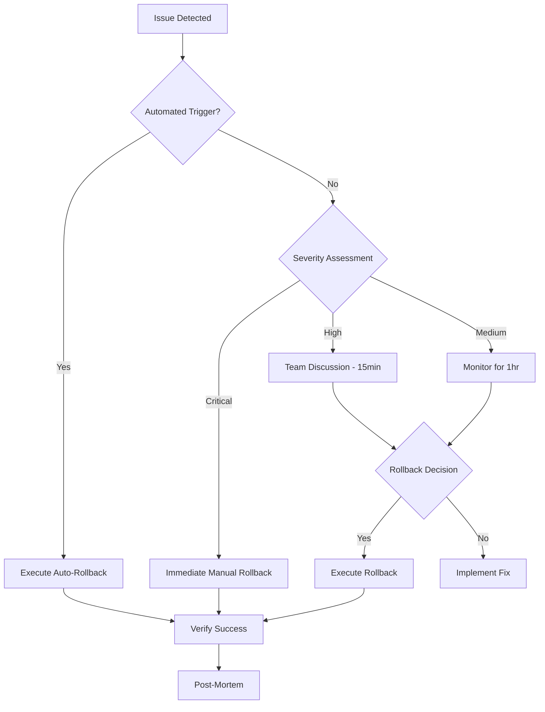

# Enhanced Rollback Procedures with Automated Triggers

## Overview

This document provides comprehensive rollback procedures with specific triggers, automated detection, and recovery mechanisms for each story in the Data Practitioner Agent System. Each procedure includes both automated and manual rollback options.

## Rollback Trigger Framework

### Automatic Trigger Conditions

```yaml
rollback_triggers:
  performance:
    - condition: "API response time > 5x baseline for 10 minutes"
      severity: CRITICAL
      auto_rollback: true
      
  errors:
    - condition: "Error rate > 25% for 5 minutes"
      severity: CRITICAL
      auto_rollback: true
      
  availability:
    - condition: "Service availability < 90% for 15 minutes"
      severity: HIGH
      auto_rollback: false  # Manual decision required
      
  resource:
    - condition: "Memory usage > 95% sustained for 10 minutes"
      severity: HIGH
      auto_rollback: true
      
  data_integrity:
    - condition: "Data validation failures > 10% of records"
      severity: CRITICAL
      auto_rollback: true
```

## Story-Specific Rollback Procedures

### Story 1.1.5: Security & Risk Management Foundation

#### Rollback Triggers
- Authentication service failure rate > 10%
- API key validation taking > 2 seconds
- Feature flag system non-responsive
- Security log write failures > 5%

#### Automated Rollback Script
```bash
#!/bin/bash
# rollback-story-1.1.5.sh

echo "🔄 Starting Story 1.1.5 Security Foundation Rollback..."

# 1. Disable security middleware
echo "Disabling security middleware..."
mv tools/data-services/security-service.js tools/data-services/security-service.js.backup
cp tools/data-services/security-service.stub.js tools/data-services/security-service.js

# 2. Revert feature flags to defaults
echo "Reverting feature flags..."
cp config/feature-flags.yaml.backup config/feature-flags.yaml

# 3. Remove API key requirements
echo "Removing API key enforcement..."
sed -i.backup 's/requireAuth: true/requireAuth: false/g' config/api-config.yaml

# 4. Restore previous configuration
echo "Restoring previous configuration..."
cp core-config.yaml.pre-1.1.5 core-config.yaml

# 5. Clear security caches
echo "Clearing security caches..."
rm -rf .cache/security/*

# 6. Restart services
echo "Restarting services..."
npm run restart:services

# 7. Verify rollback
echo "Verifying rollback..."
npm run test:rollback:security

echo "✅ Story 1.1.5 rollback completed"
```

#### Manual Rollback Checklist
- [ ] Notify team of security rollback initiation
- [ ] Disable authentication middleware
- [ ] Revert feature flag configuration
- [ ] Clear API key cache
- [ ] Update documentation
- [ ] Communicate to users about temporary security changes

### Story 1.2: PyAirbyte Integration

#### Rollback Triggers
- PyAirbyte subprocess crashes > 3 times in 10 minutes
- Data ingestion rate < 100 records/second for 15 minutes
- Memory usage by PyAirbyte > 4GB
- Python subprocess communication timeout > 30 seconds

#### Automated Rollback Script
```bash
#!/bin/bash
# rollback-story-1.2.sh

echo "🔄 Starting Story 1.2 PyAirbyte Rollback..."

# 1. Stop PyAirbyte processes
echo "Stopping PyAirbyte processes..."
pkill -f pyairbyte || true
pm2 stop data-ingestion-service || true

# 2. Disable ingestion endpoints
echo "Disabling ingestion endpoints..."
export FEATURE_FLAG_PYAIRBYTE=false
npm run feature:toggle pyairbyte_integration off

# 3. Remove PyAirbyte wrapper
echo "Removing PyAirbyte integration..."
mv tools/data-services/data-ingestion-service.js tools/data-services/data-ingestion-service.js.backup
mv tools/data-services/pyairbyte-wrapper.js tools/data-services/pyairbyte-wrapper.js.backup

# 4. Clean up cache
echo "Cleaning PyAirbyte cache..."
rm -rf .cache/pyairbyte/*

# 5. Restore stub services
echo "Restoring stub services..."
cp tools/data-services/stubs/ingestion-stub.js tools/data-services/data-ingestion-service.js

# 6. Deactivate Python environment
echo "Deactivating Python environment..."
deactivate 2>/dev/null || true

# 7. Restart core services
echo "Restarting core services..."
npm run restart:core

# 8. Run verification
echo "Verifying rollback..."
npm run test:rollback:ingestion

echo "✅ Story 1.2 rollback completed"
```

### Story 1.3: DuckDB Integration

#### Rollback Triggers
- DuckDB query timeout > 2 minutes occurring > 5 times/hour
- DuckDB memory usage > 8GB
- Database corruption detected
- Query error rate > 15%

#### Automated Rollback Script
```bash
#!/bin/bash
# rollback-story-1.3.sh

echo "🔄 Starting Story 1.3 DuckDB Rollback..."

# 1. Stop analytical queries
echo "Stopping analytical queries..."
node scripts/stop-analytics.js

# 2. Disable DuckDB integration
echo "Disabling DuckDB..."
export FEATURE_FLAG_DUCKDB=false
npm run feature:toggle duckdb_analytics off

# 3. Backup DuckDB data
echo "Backing up DuckDB data..."
mv .duckdb .duckdb.rollback.$(date +%Y%m%d_%H%M%S)

# 4. Remove analytical engine
echo "Removing analytical engine..."
mv tools/data-services/analytical-engine.js tools/data-services/analytical-engine.js.backup

# 5. Install fallback query engine
echo "Installing fallback query engine..."
cp tools/data-services/stubs/simple-query-engine.js tools/data-services/analytical-engine.js

# 6. Clear query cache
echo "Clearing query cache..."
rm -rf .cache/queries/*

# 7. Restart services
echo "Restarting services..."
npm run restart:analytics

echo "✅ Story 1.3 rollback completed"
```

### Story 1.4: dbt-core Integration

#### Rollback Triggers
- dbt run failure rate > 20%
- Transformation time > 2x baseline
- Test failure rate > 30%
- Model compilation errors > 10

#### Automated Rollback Script
```bash
#!/bin/bash
# rollback-story-1.4.sh

echo "🔄 Starting Story 1.4 dbt-core Rollback..."

# 1. Stop dbt runs
echo "Stopping dbt processes..."
pkill -f "dbt run" || true
pkill -f "dbt test" || true

# 2. Disable transformation features
echo "Disabling transformations..."
npm run feature:toggle dbt_transformations off

# 3. Backup dbt project
echo "Backing up dbt project..."
mv dbt_project dbt_project.rollback.$(date +%Y%m%d_%H%M%S)

# 4. Remove transformation engine
echo "Removing transformation engine..."
mv tools/data-services/transformation-engine.js tools/data-services/transformation-engine.js.backup

# 5. Clear compiled models
echo "Clearing compiled models..."
rm -rf target/*
rm -rf logs/dbt/*

# 6. Restore simple transformations
echo "Restoring simple transformations..."
cp -r transformations/simple/* transformations/

echo "✅ Story 1.4 rollback completed"
```

### Story 1.5: Dagster Integration

#### Rollback Triggers
- Dagster daemon crash > 2 times in 1 hour
- Pipeline execution backlog > 100 jobs
- Asset materialization failure > 25%
- Web UI unresponsive for > 10 minutes

#### Automated Rollback Script
```bash
#!/bin/bash
# rollback-story-1.5.sh

echo "🔄 Starting Story 1.5 Dagster Rollback..."

# 1. Stop Dagster daemon
echo "Stopping Dagster..."
dagster instance stop || true
pkill -f dagster || true

# 2. Disable orchestration
echo "Disabling orchestration..."
npm run feature:toggle dagster_orchestration off

# 3. Backup Dagster instance
echo "Backing up Dagster instance..."
mv ~/.dagster ~/.dagster.rollback.$(date +%Y%m%d_%H%M%S)

# 4. Remove orchestrator
echo "Removing orchestrator..."
mv tools/data-services/workflow-orchestrator.js tools/data-services/workflow-orchestrator.js.backup

# 5. Install simple scheduler
echo "Installing simple scheduler..."
cp tools/data-services/stubs/simple-scheduler.js tools/data-services/workflow-orchestrator.js

# 6. Clear run history
echo "Clearing run history..."
rm -rf .dagster/storage/*

echo "✅ Story 1.5 rollback completed"
```

### Story 1.6: EDA & Hypothesis Generation

#### Rollback Triggers
- LLM API errors > 50% of requests
- Hypothesis generation time > 5 minutes
- Memory usage during EDA > 6GB
- Statistical computation errors > 20%

#### Automated Rollback Script
```bash
#!/bin/bash
# rollback-story-1.6.sh

echo "🔄 Starting Story 1.6 EDA Rollback..."

# 1. Disable EDA features
echo "Disabling EDA features..."
npm run feature:toggle automated_eda off
npm run feature:toggle hypothesis_generation off

# 2. Stop analysis processes
echo "Stopping analysis processes..."
pm2 stop analysis-service || true

# 3. Remove EDA tools
echo "Removing EDA tools..."
pip uninstall -y pandas-profiling sweetviz autoviz

# 4. Clear analysis cache
echo "Clearing analysis cache..."
rm -rf .cache/analysis/*
rm -rf .cache/hypotheses/*

# 5. Restore basic analysis
echo "Restoring basic analysis..."
cp tools/data-services/stubs/basic-analysis.js tools/data-services/eda-engine.js

echo "✅ Story 1.6 rollback completed"
```

### Story 1.7: Evidence.dev Integration

#### Rollback Triggers
- Build time > 10 minutes
- Page load time > 5 seconds
- Build failures > 3 consecutive
- Memory usage during build > 4GB

#### Automated Rollback Script
```bash
#!/bin/bash
# rollback-story-1.7.sh

echo "🔄 Starting Story 1.7 Evidence.dev Rollback..."

# 1. Stop Evidence.dev builds
echo "Stopping Evidence builds..."
pkill -f "evidence build" || true
pm2 stop evidence-builder || true

# 2. Disable publication features
echo "Disabling publications..."
npm run feature:toggle evidence_publications off

# 3. Backup Evidence project
echo "Backing up Evidence project..."
mv evidence_project evidence_project.rollback.$(date +%Y%m%d_%H%M%S)

# 4. Remove publication engine
echo "Removing publication engine..."
mv tools/data-services/publication-engine.js tools/data-services/publication-engine.js.backup

# 5. Clear build artifacts
echo "Clearing build artifacts..."
rm -rf .evidence/build/*
rm -rf public/*

# 6. Install basic reporting
echo "Installing basic reporting..."
cp tools/data-services/stubs/basic-reporter.js tools/data-services/publication-engine.js

echo "✅ Story 1.7 rollback completed"
```

### Story 1.8: Quality Assurance

#### Rollback Triggers
- Test suite execution time > 1 hour
- Test infrastructure failure
- Documentation generation failure
- Integration test pass rate < 70%

#### Manual Rollback Only
```bash
#!/bin/bash
# rollback-story-1.8.sh

echo "🔄 Starting Story 1.8 QA Rollback..."

# This is primarily documentation and testing
# Rollback involves reverting to previous test suites

# 1. Restore previous test suite
echo "Restoring previous tests..."
git checkout HEAD~1 -- tests/

# 2. Restore previous documentation
echo "Restoring documentation..."
git checkout HEAD~1 -- docs/

echo "✅ Story 1.8 rollback completed"
```

## Rollback Orchestration

### Master Rollback Controller

```javascript
// tools/rollback/rollback-manager.js
const RollbackManager = {
  triggers: {
    performance: {
      checkInterval: 60000, // 1 minute
      conditions: [
        {
          metric: 'api_response_time',
          threshold: (baseline) => baseline * 5,
          duration: 600000, // 10 minutes
          action: 'auto_rollback'
        }
      ]
    },
    
    errors: {
      checkInterval: 30000, // 30 seconds
      conditions: [
        {
          metric: 'error_rate',
          threshold: 0.25, // 25%
          duration: 300000, // 5 minutes
          action: 'auto_rollback'
        }
      ]
    }
  },
  
  executeRollback: async (storyId, trigger) => {
    console.log(`🚨 Rollback triggered for Story ${storyId}`);
    console.log(`Trigger: ${JSON.stringify(trigger)}`);
    
    // 1. Notify team
    await notifyTeam({
      severity: 'CRITICAL',
      message: `Auto-rollback initiated for Story ${storyId}`,
      trigger
    });
    
    // 2. Execute rollback script
    const result = await execScript(`./rollback-story-${storyId}.sh`);
    
    // 3. Verify rollback success
    const verified = await verifyRollback(storyId);
    
    // 4. Update feature flags
    await updateFeatureFlags(storyId, false);
    
    // 5. Log rollback
    await logRollback({
      storyId,
      trigger,
      result,
      verified,
      timestamp: new Date()
    });
    
    return { success: verified, details: result };
  }
};
```

## Rollback Verification

### Automated Verification Tests

```javascript
// tests/rollback/verify-rollback.js
const verifyRollback = async (storyId) => {
  const checks = {
    '1.1.5': async () => {
      // Verify security is bypassed
      const authDisabled = await testEndpoint('/health', null);
      return authDisabled.status === 200;
    },
    
    '1.2': async () => {
      // Verify PyAirbyte is disabled
      const ingestionDisabled = await testFeatureFlag('pyairbyte_integration');
      const processesKilled = await checkProcesses('pyairbyte');
      return ingestionDisabled === false && processesKilled.length === 0;
    },
    
    '1.3': async () => {
      // Verify DuckDB is disabled
      const analyticsDisabled = await testFeatureFlag('duckdb_analytics');
      const dbClosed = await checkDuckDBConnections();
      return analyticsDisabled === false && dbClosed === true;
    }
    // ... more verification functions
  };
  
  return await checks[storyId]();
};
```

## Communication Plan for Rollbacks

### Automated Notifications

```yaml
notifications:
  immediate:
    - channel: pagerduty
      condition: auto_rollback_initiated
      template: "CRITICAL: Story {story_id} auto-rollback in progress"
      
  status_updates:
    - channel: slack
      condition: rollback_progress
      template: "Rollback {story_id}: {status} - {details}"
      
  completion:
    - channel: email
      condition: rollback_complete
      template: rollback_complete_email.html
      recipients: [dev-team, product-owner, support-team]
```

### Manual Rollback Decision Tree



## Post-Rollback Procedures

### Immediate Actions
1. Verify system stability
2. Document rollback reason and impact
3. Notify affected users
4. Begin root cause analysis

### Follow-up Actions
1. Schedule post-mortem (within 48 hours)
2. Update story implementation based on findings
3. Enhance monitoring for identified issues
4. Update rollback procedures if needed

---
*Created: 2025-08-09*
*Version: 1.0*
*Critical Document - Keep Updated*