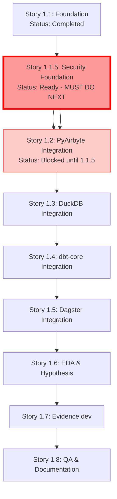

# Story Execution Sequence - Security-First Approach

## Critical Sequencing Requirements

**MANDATORY**: Story 1.1.5 (Security & Risk Management Foundation) must be completed BEFORE Story 1.2 (PyAirbyte Integration) begins. This ensures all data operations have proper authentication, monitoring, and rollback capabilities from the start.

## Execution Order with Dependencies

## Story Dependency Matrix

| Story | Dependencies | Security Requirements | Can Start When |
|-------|--------------|----------------------|----------------|
| 1.1 | None | N/A | Completed ✅ |
| 1.1.5 | 1.1 | Self-implementing | IMMEDIATELY |
| 1.2 | 1.1, **1.1.5** | API Auth, Feature Flags | After 1.1.5 complete |
| 1.3 | 1.1, 1.1.5, 1.2 | API Auth, Logging | After 1.2 complete |
| 1.4 | 1.1, 1.1.5, 1.2, 1.3 | Secure Config | After 1.3 complete |
| 1.5 | 1.1-1.4 | Web UI Security | After 1.4 complete |
| 1.6 | 1.1-1.5 | LLM Key Management | After 1.5 complete |
| 1.7 | 1.1-1.6 | Publication Security | After 1.6 complete |
| 1.8 | All | Comprehensive Testing | After 1.7 complete |

## Pre-Implementation Gates

### Gate 1: Before Starting Story 1.2
**Security Validation Checklist:**
- [ ] API Key generation and validation working
- [ ] Authentication middleware tested
- [ ] Feature flags operational with proper defaults
- [ ] Security logging capturing events
- [ ] Rollback scripts created and tested
- [ ] Security documentation complete

### Gate 2: Before Each Subsequent Story
- [ ] Previous story's security controls verified
- [ ] Feature flag for new story configured
- [ ] Rollback procedure for new story documented
- [ ] Security tests passing

## Timeline Adjustments

### Original Timeline
- Week 1-2: Stories 1.1, 1.2
- Week 3-4: Story 1.3

### Revised Timeline  
- Week 1-2: Story 1.1 (✅), Story 1.1.5
- Week 3: Complete 1.1.5, Start 1.2
- Week 4-5: Complete 1.2, Start 1.3

**Net Impact**: +3-5 days, but significantly improved security posture

---
*Created: 2025-08-09*
*Owner: Product Owner Sarah*